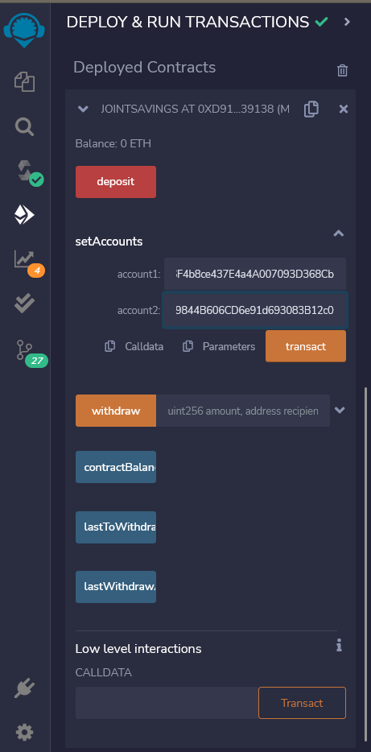
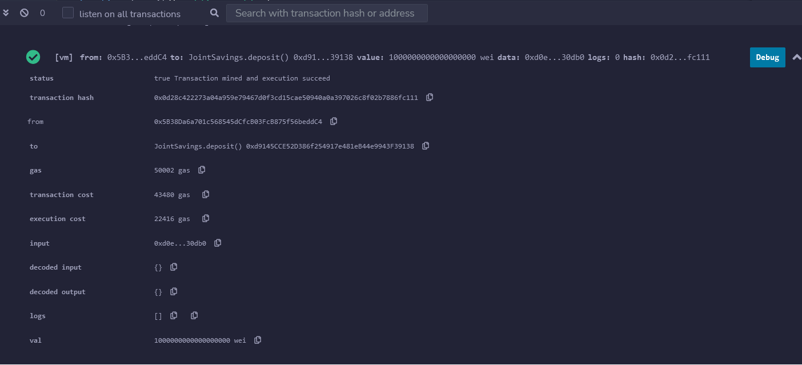
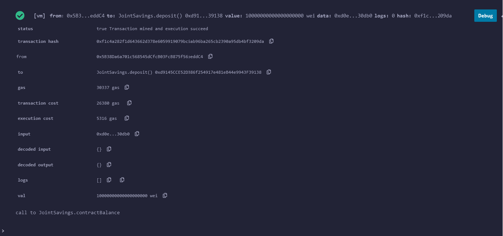
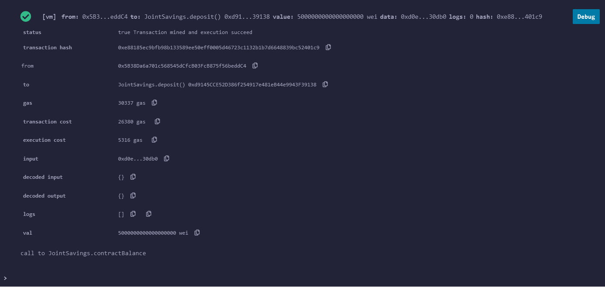
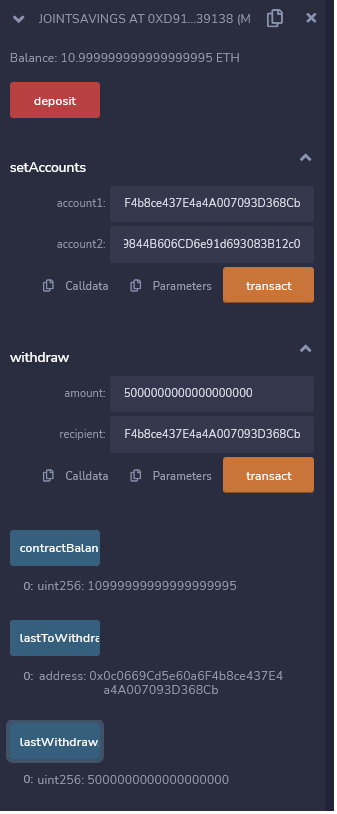
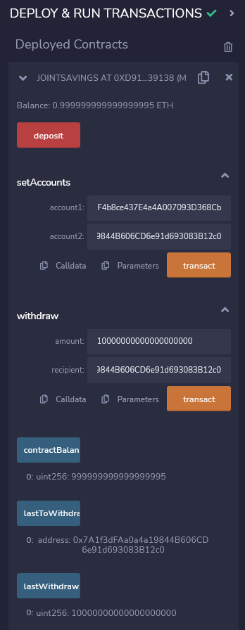

# *Blockchain Application*

The purpose of the Joint Savings file is to create a Solidity smart contract that accepts two user addresses. These addresses, in turn, will be able to control a joint savings account.

---

## **Required Technologies**

This application requires the following depedencies, `Solidity` and `Remix`.

---

## Starting Balance ##

## Transaction 1 - Deposit One Ether ##

---

## Transaction 2 - Deposit Ten Ether ##

---

## Transaction 3 - Deposit Five Ether ##

---

## Transaction 4 - Withdrawl Five Ether ##

---

## Transaction 5 - Withdrawl Ten Ether ##

---

## Contributors

Adam Jimenez - FinTech Student

---

## License

2022 edX Bootcamps

